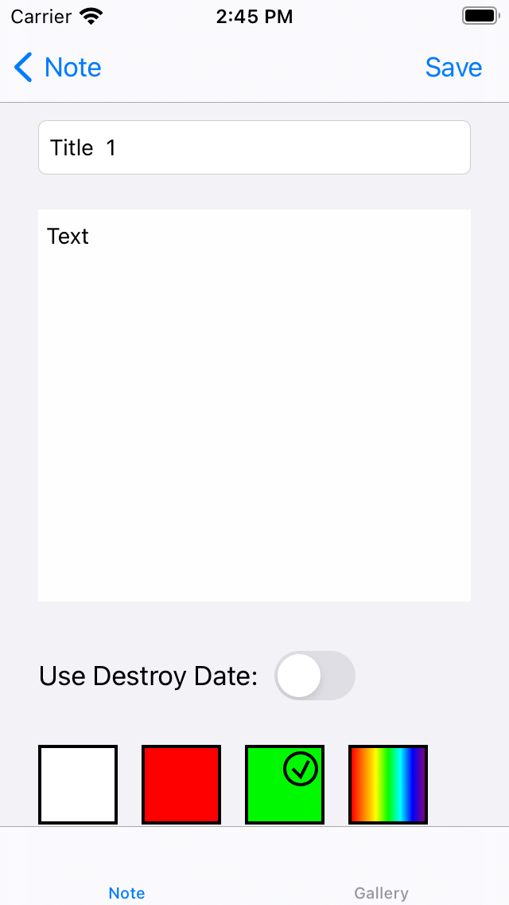
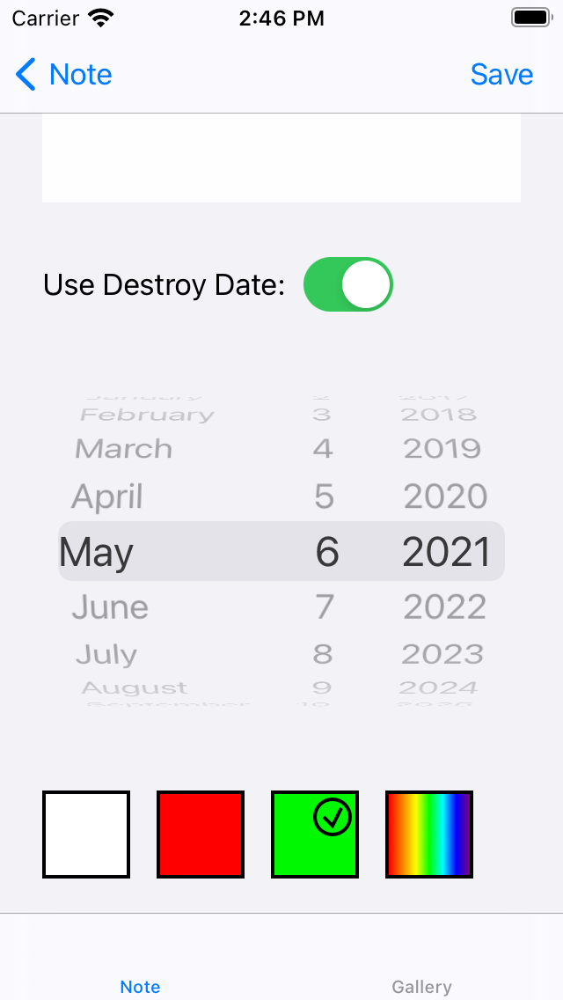
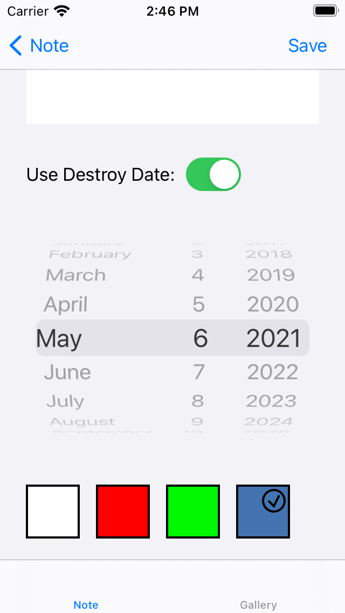
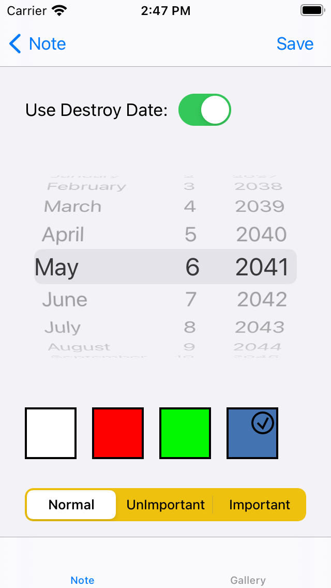
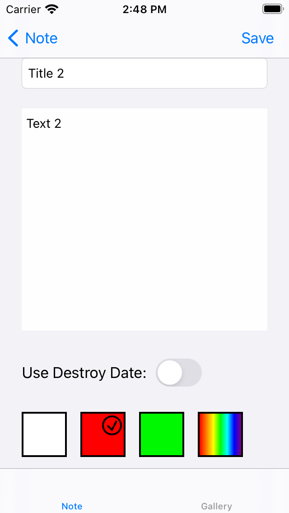
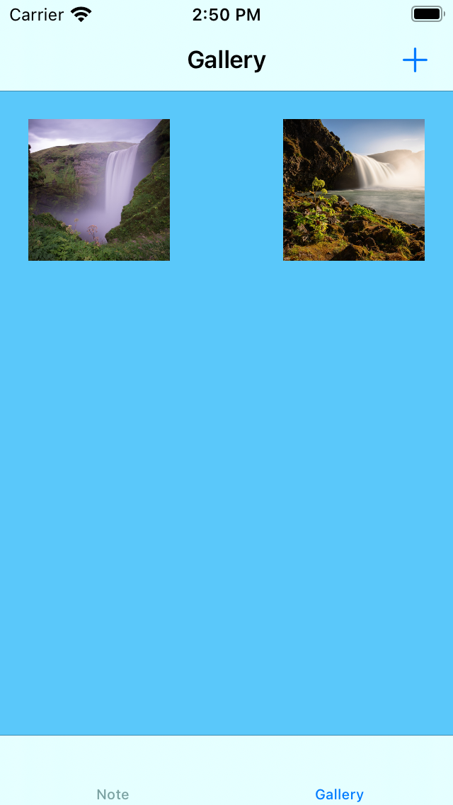
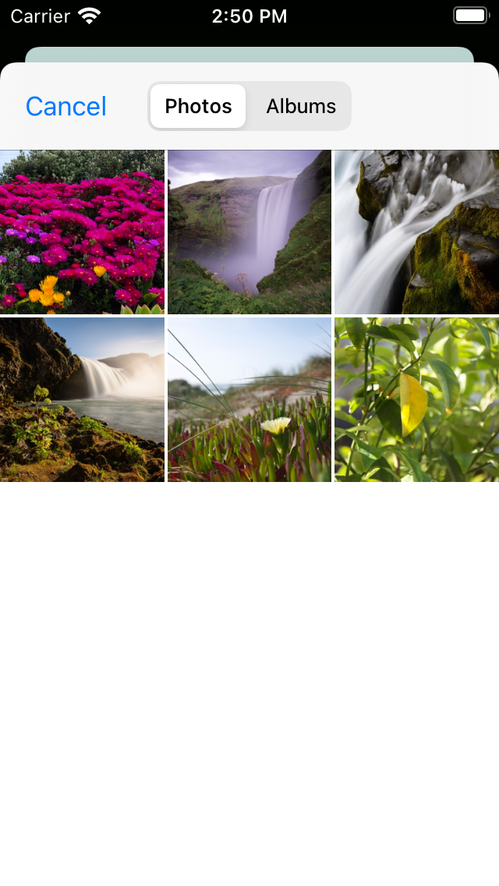
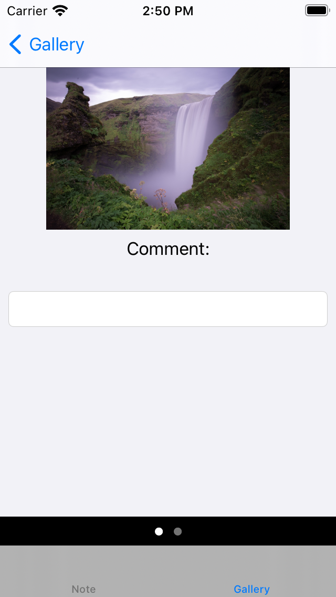
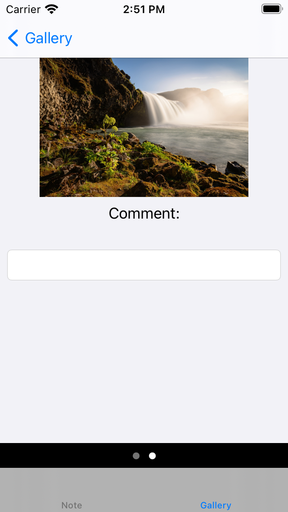

# Note
Приложение заметок. Представлена в виде структуры Note. Note содержит:

• Уникальный идентификатор uid. Если не задан пользователем, генерируется с помощью UUID().uuidString.

• Обязательные строковые поля — title и content.

• Цвет заметки — color. Пользователь сможет создать заметку любого цвета.

• Обязательное поле importance (enum с тремя значениями: «unimportant», «normal» и «important»).

• Содержит необязательное поле selfDestructionDate типа Date.

• Содержит расширение для работы с json файлами: функция для разбора json,
вычислимое свойство для формирования json(если цвет НЕ белый, сохраняет его в json, Если важность «обычная», НЕ сохраняет её в json).
Имеется FileNotebook для добавления и удаления заметки, сохранения в файл всей записной книжки и ее загрузки.
Содержится экран редактирования заметки. На этом экране есть квадратик для выбора цвета,
при долгом нажатии на который открывается Color Picker, для выбора кастомного цвета.
Также, имеются фото-заметки.

Хранение заметок осуществляется в операциях: локально, в Core Data и удаленно на github gists.

